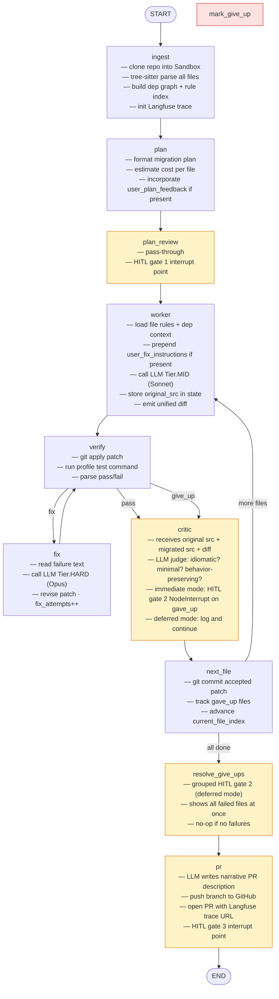
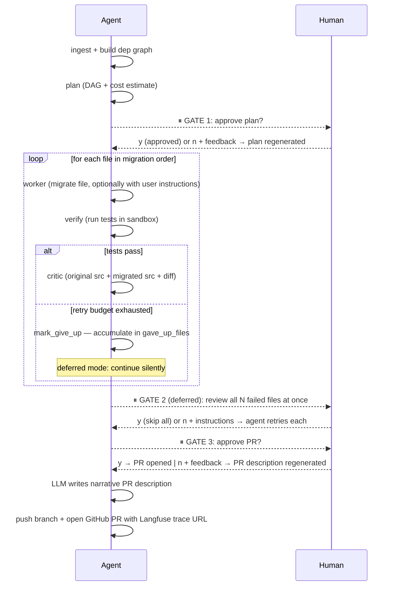
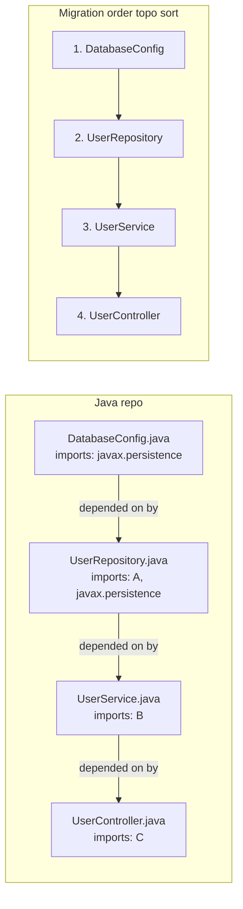
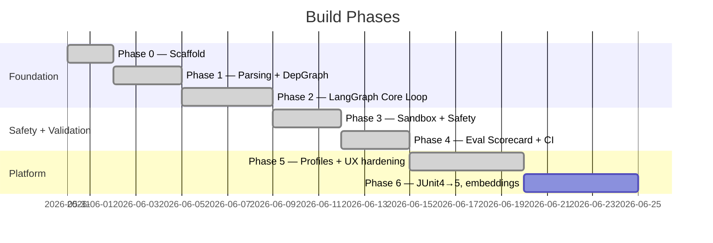
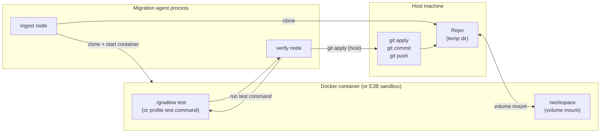

# code-migration-agent — Architecture

## System Overview

This is a **platform**, not a one-off tool. The engine stays constant; only the
*profile* (rules + test command) changes per migration type.

```
┌──────────────────────────────────────────────┐
│  Profiles  (declarative, one per migration)  │
│  Java→Kotlin  ·  JUnit4→5  ·  Spring 2→3    │
└────────────────────┬─────────────────────────┘
                     │ rules.md + tests.toml
┌────────────────────▼─────────────────────────┐
│  migration-agent  (the orchestrated platform) │
│  LangGraph workflow  ·  tree-sitter parsing   │
│  dependency graph  ·  HITL gates  ·  PR gen  │
└────────────────────┬─────────────────────────┘
                     │ model / tracing / sandbox / budget
┌────────────────────▼─────────────────────────┐
│  agent-core  (substrate — reusable)           │
│  Anthropic + OpenAI  ·  Langfuse  ·  Evals   │
│  SQLite task queue  ·  Sandbox Protocol       │
└──────────────────────────────────────────────┘
```

---

## LangGraph Workflow

The inner loop as a directed graph. Nodes are Python functions; edges are
deterministic or conditional. Checkpointing happens at every node boundary.



**Yellow nodes** = HITL interrupt points at `HITL_LEVEL=full`.
**Red node** = `mark_give_up` sets `current_file_gave_up=True` before `critic`.

Gate 2 has two modes (controlled by `--hitl-gate2` / `HITL_GATE2` env var):
- **`deferred`** (default): `critic` logs the failure and continues; `resolve_give_ups` groups all failures into a single interrupt before the PR gate
- **`immediate`**: `critic` raises `NodeInterrupt` per file when retries are exhausted (original behaviour)

The CLI stays alive through all gates with an inline y/n prompt loop — no `--resume` command needed. On "n" the user provides feedback and the relevant node reruns.

---

## HITL Gates

Three toggleable checkpoints. Each maps to a `interrupt_before` node in LangGraph.



`HITL_LEVEL` env var controls which gates fire:

| Level | Gates active |
|---|---|
| `full` | plan approval · give-up review · PR review |
| `plan_only` | plan approval only |
| `none` | fully autonomous (CI / benchmarking) |

`HITL_GATE2` env var (or `--hitl-gate2`) controls gate 2 timing:

| Mode | Behaviour |
|---|---|
| `deferred` (default) | All give-up failures shown together in one gate before PR |
| `immediate` | Each failure interrupts immediately after it occurs |

**The CLI loop**: The agent process stays alive across all gates. At each gate
an inline `[y/n]` prompt is shown. Typing `n` opens a feedback prompt; the agent
injects the feedback into state and re-runs the appropriate node.

---

## Dependency Graph & Migration Order

tree-sitter parses every source file into an AST. We extract edges, build a
directed graph, and topologically sort it so leaf modules migrate first.



Each file also gets a **rule index** — the set of breaking-change rules triggered
by its AST patterns (e.g. `javax.persistence` import → `javax→jakarta` rule).

---

## Data Flow

How information moves through a single file migration:

```mermaid
flowchart LR
    repo[("Git Repo\n(Sandbox clone)")] --> ts[tree-sitter\nparser]
    ts --> depgraph[Dependency\nGraph]
    ts --> ruleidx[Rule Index\n(AST-keyed)]
    depgraph --> order[Migration\nOrder]
    ruleidx --> worker
    order --> worker

    worker["worker node\n(LLM Tier.MID)"] --> patch[Unified\nDiff]
    patch --> verify["verify node\n(Sandbox + test cmd)"]
    verify -->|pass| critic["critic node\n(LLM judge)"]
    verify -->|fail| fix["fix node\n(LLM Tier.HARD)"]
    fix --> verify
    critic --> pr["pr node\n(GitHub API)"]
    pr --> github[(GitHub PR\n+ Langfuse trace)]
```

---

## Eval Scorecard

Every run emits a scorecard logged to Langfuse and gated in CI.

| Metric | Signal |
|---|---|
| Migration success rate | % files / repos reaching green tests |
| Retry count | avg fix-loop iterations (efficiency) |
| Tokens / cost (USD) | per file + per repo (unit economics) |
| Human interventions | which HITL gates fired, how often |
| Files changed / diff size | scope discipline |
| **PR acceptance rate** | **north star** — % of generated PRs a human merges as-is |

CI fails if `migration_success_rate` regresses vs. the last run.

---

## Phase Roadmap



## Implementation Status

| Component | File | Phase | Status |
|---|---|---|---|
| Dep graph (tree-sitter) | `depgraph.py` | 1 | ✅ |
| Rule loader | `rule_loader.py` | 1 | ✅ |
| ingest node | `nodes/ingest.py` | 1 | ✅ |
| plan node | `nodes/plan.py` | 1 | ✅ |
| plan_review node | `nodes/plan_review.py` | 2 | ✅ |
| worker node (LLM Tier.MID) | `nodes/worker.py` | 2 | ✅ |
| verify node (git apply + tests) | `nodes/verify.py` | 2 | ✅ (LocalSandbox) |
| fix node (LLM Tier.HARD) | `nodes/fix.py` | 2 | ✅ |
| critic node (LLM judge) | `nodes/critic.py` | 2 | ✅ |
| next_file node (commit + route) | `nodes/next_file.py` | 2 | ✅ |
| pr node (PyGithub) | `nodes/pr.py` | 2 | ✅ |
| agent-core model tiers | `agent_core/models.py` | 2 | ✅ |
| agent-core LocalSandbox | `agent_core/sandbox.py` | 2 | ✅ |
| agent-core DockerSandbox | `agent_core/sandbox.py` | 3 | ✅ |
| agent-core E2BSandbox | `agent_core/sandbox.py` | 3 | ✅ |
| Budget circuit breaker | `agent_core/models.py` | 3 | ✅ |
| Sandbox ↔ verify/ingest | `nodes/verify.py`, `nodes/ingest.py` | 3 | ✅ |
| Eval scorecard + CI | `evals/runner.py` | 4 | ✅ |
| Corpus manifest | `evals/corpus/manifest.toml` | 4 | ✅ (needs repo verification) |
| CI workflows | `.github/workflows/evals*.yml` | 4 | ✅ |
| ADR eval methodology | `docs/adr/001-eval-methodology.md` | 4 | ✅ |
| mark_give_up node | `nodes/verify.py` | 4 | ✅ |
| FileEvalRecord in state | `state.py` | 4 | ✅ |
| Inline HITL y/n loop | `cli.py` | 5 | ✅ |
| Deferred (grouped) give-up gate | `nodes/resolve_give_ups.py`, `hitl.py` | 5 | ✅ |
| Critic: original + migrated src context | `nodes/critic.py`, `nodes/worker.py` | 5 | ✅ |
| LLM-generated PR description | `nodes/pr.py` | 5 | ✅ |
| Profile scaffold CLI command | `cli.py`, `scaffold.py` | 5 | ✅ |
| keywords.toml per-profile keyword config | `rule_loader.py`, `profiles/__init__.py` | 5 | ✅ |
| Maven Java profile | `profiles/java_to_kotlin_maven/` | 5 | ✅ |
| Spring Boot 2→3 profile (Gradle) | `profiles/spring_boot_2_to_3/` | 5 | ✅ |
| Spring Boot 2→3 profile (Maven) | `profiles/spring_boot_2_to_3_maven/` | 5 | ✅ |
| Langfuse tracing | `agent_core/tracing.py` | 5 | ✅ |
| JUnit4→5 profile | `profiles/junit4_to_junit5/` | 6 | ⬜ |

---

## Phase 3 — Sandbox Isolation Model



**Split execution model:**
- `git apply`, `git reset`, `git commit` → run on HOST (fast, no Docker overhead)
- Test commands → run INSIDE container (isolated, resource-limited)
- Volume mount means patched files are instantly visible to the container — no copying

**Sandbox backends:**

| Backend | `SANDBOX_BACKEND` | Used for | Requirements |
|---|---|---|---|
| `LocalSandbox` | `local` (default) | Dev / unit tests | None |
| `DockerSandbox` | `docker` | Local dev | Docker Desktop running |
| `E2BSandbox` | `e2b` | CI | `E2B_API_KEY` env var |

**DockerSandbox resource limits (configurable via env vars):**

| Limit | Env var | Default |
|---|---|---|
| Memory | `SANDBOX_MEM_LIMIT` | `4g` |
| CPU quota | `SANDBOX_CPU_QUOTA` | `100000` (1 CPU) |
| Test timeout | `TEST_TIMEOUT_SECONDS` | `300` |

**Budget circuit breaker:**
- `AGENT_CORE_MAX_USD_PER_TASK` caps total LLM spend per run (default `$5.00`)
- Charged after every `complete()` call using Anthropic response `usage` tokens
- `BudgetExceededError` raised mid-run if limit hit; LangGraph checkpoint preserves state

## Key Design Decisions

- **No vector DB in v1** — migration rules are bounded + AST-keyed (exact lookup
  beats fuzzy retrieval for safety-critical transforms). See
  `context-and-retrieval.md` for the full argument.
- **LangGraph over raw loops** — explicit nodes, shared state, checkpointing, and
  `interrupt_before` make HITL gates first-class, not bolted on.
- **Profile = rules.md + tests.toml** — the engine never changes; only the profile
  does. Proves this is a platform, not a one-off.
- **Sandbox isolation** — all generated code runs in Docker (local) or E2B (CI).
  Patches are git commits inside the sandbox — fully revertable.
